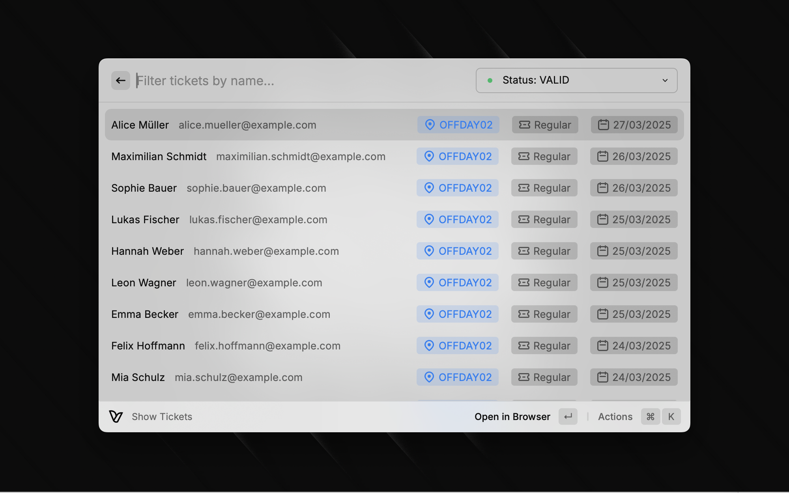
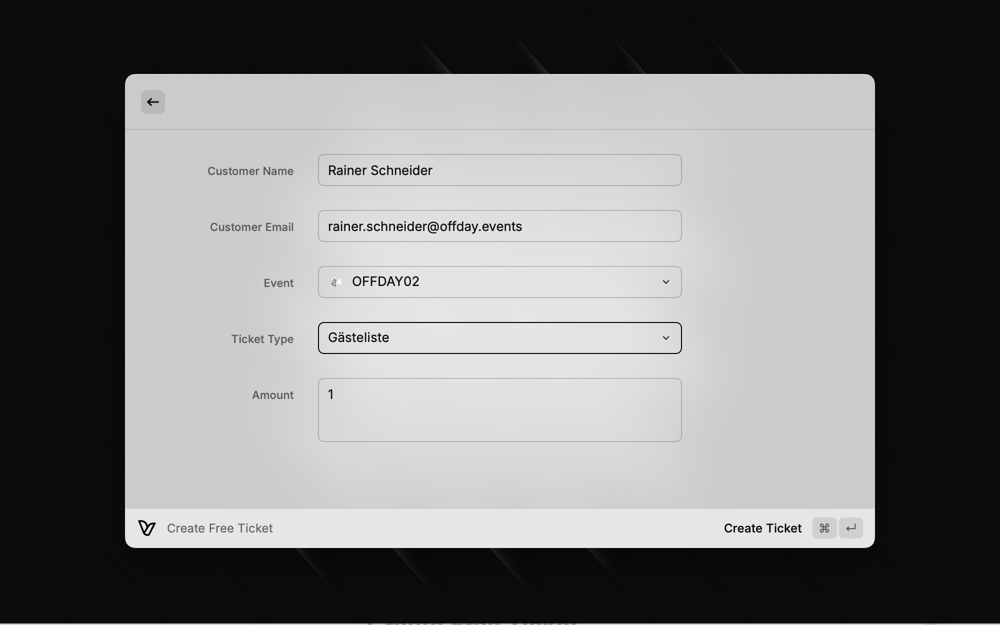

# Raycast Vivenu Extension

This is a [Raycast](https://raycast.com) extension for interacting with the [Vivenu](https://vivenu.com) Ticketing Platform.

## Pre-requisites

- You need to have a Vivenu account and an API key to use this extension.
- The extension will ask you to provide the API key when you first open it.

## Commands

### Show Tickets

Shows the latest tickets for the current account. You can filter the tickets by status.

You can then either:

- Open the ticket in the dashboard
- Resend the ticket mail to the customer
- Send the ticket mail to another email address

### Create Free Ticket

Creates a free ticket for the current account.

- You can specify the event, the ticket type, and the email address of the ticket holder.
